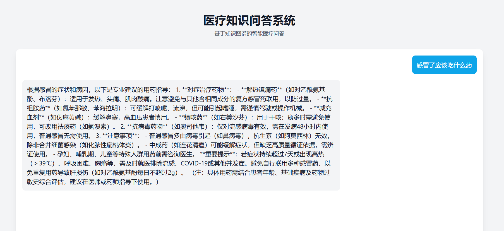

# GraphRAG: 基于知识图谱的医学知识智能检索与问答系统

使用 VS Code + Claude Code 进行医学知识图谱问答系统的前后端 vibe coding 开发，提供聊天主界面，支持多种主流 API 模型的切换。

针对传统医疗 RAG 在复杂疾病关联推理、跨实体语义检索及临床知识碎片化等问题，引入 Neo4j 与 ChromaDB 构建 GraphRAG 医学知识问答系统。将知识图谱的精确检索能力与生成式 AI 的语义理解能力相结合，为用户提供准确、及时的医疗咨询服务。

## 效果图



## 技术实现

### 1. 医学知识图谱构建与结构化检索
- 基于 LLM 提取 200+ 份医学文档、权威网站数据及疾病拓扑中的实体与关系并存入 Neo4j
- 结合 ChromaDB 向量检索构建多路召回架构
- 采用 LLM 别名对齐与实体抽取解决口语化表达与结构化数据的异构对齐问题，消除手工维护领域词典的扩展瓶颈

### 2. 基于查询分析的动态路由
- 利用实体链接与意图分类器分析查询复杂度
- 基础概念与模糊查询分流至向量检索
- 跨实体复杂关联分发至图引擎
- 未命中时由 LLM 自生成 Cypher 兜底
- 显著降低 API 调用成本与响应延迟

### 3. 多跳图推理与查询改写
- 基于图数据库实现跨疾病发现、药物关联追溯等三类多跳推理模式
- 将隐含关联显式注入上下文
- 结合 LangChain 实现 LLM 查询改写机制
- 自动进行多轮对话中的指代消解，减少传统 RAG 在多轮交互中因上下文断裂导致的检索漂移

## 系统架构

### GraphRAG 技术架构
- **知识图谱检索层**：基于 Neo4j 的高效图数据库检索，精确匹配实体与关系
- **向量语义检索层**：基于 ChromaDB 的实体向量索引，支持问题与实体的语义匹配
- **语义理解层**：DeepSeek API 的深度语义理解与生成
- **知识融合层**：图检索结果 + 向量检索结果 + 生成模型的智能融合
- **流式响应层**：实时流式生成与展示

### 知识图谱规模
- 4.4 万医疗实体节点
- 30 万实体关系边
- 支持多种实体类型：疾病、症状、药品、检查项目等
- 支持多种关系类型：症状、病因、治疗、检查等

## 技术特点

- 🔄 GraphRAG 架构：图数据库检索 + 向量语义检索 + 生成式 AI
- 🎯 精准检索：基于 Neo4j 图数据库的结构化知识检索
- 🔍 语义匹配：基于 ChromaDB + text2vec 中文向量模型的实体语义搜索
- 🤖 智能生成：基于检索结果的上下文感知生成
- ⚡ 实时响应：流式输出，即时反馈
- 🛡️ 离线支持：知识图谱不可用时仍可提供服务

## 技术栈

### 后端
- Python 3.x
- Flask：Web 框架
- Neo4j：图数据库
- ChromaDB：向量数据库（实体语义索引）
- sentence-transformers (shibing624/text2vec-base-chinese)：中文语义向量模型
- DeepSeek API (langchain-openai)：生成模型
- jieba：中文分词与关键词提取
- python-dotenv：环境变量管理

### 前端
- React：UI 框架
- Tailwind CSS：样式框架
- Axios：HTTP 客户端

## 快速开始

### 1. 环境要求
- Python 3.8+
- Node.js 14+
- Neo4j 数据库
- DeepSeek API 密钥

### 2. 安装步骤

1. 克隆仓库
```bash
git clone https://github.com/erectsrhapsodesxx-max/GraphRAG.git
cd GraphRAG
```

2. 后端设置
```bash
# 创建虚拟环境
python -m venv venv
source venv/bin/activate  # Linux/Mac
venv\Scripts\activate     # Windows

# 安装依赖
pip install -r requirements.txt

# 配置环境变量
cp .env.example .env
# 编辑 .env 文件，填入你的配置
```

3. 构建知识图谱
```bash
# 将医疗数据导入 Neo4j
python build_medicalgraph.py

# 构建实体向量索引（ChromaDB）
python entity_indexer.py
```

4. 前端设置
```bash
cd frontend
npm install
```

### 3. 运行系统

1. 启动 Neo4j 数据库

2. 启动后端服务
```bash
python graphrag_qa_system.py
```

3. 启动前端服务
```bash
cd frontend
npm start
```

4. 访问系统
打开浏览器访问 http://localhost:3000

## 项目结构

```
GraphRAG/
├── frontend/                  # React 前端
│   ├── src/
│   │   ├── components/       # React 组件
│   │   ├── App.js           # 主应用组件
│   │   └── index.js         # 入口文件
│   └── public/              # 静态资源
├── chat_deepseek_api.py      # GraphRAG 核心处理模块（Neo4j + ChromaDB + DeepSeek）
├── graphrag_qa_system.py     # Flask Web 服务（流式问答 API）
├── build_medicalgraph.py     # 医疗知识图谱构建（导入 Neo4j）
├── entity_indexer.py         # 实体向量索引构建（Neo4j → ChromaDB）
├── answer_search.py          # Neo4j Cypher 查询与答案组装
├── question_parser.py        # 问题解析与分类
├── dict/                    # 医疗领域词典
├── chroma_db/               # ChromaDB 向量数据库文件
├── requirements.txt         # Python 依赖
└── README.md               # 项目文档
```

## GraphRAG 工作流程

1. 用户输入问题
2. 系统解析问题意图，提取关键实体
3. 从 Neo4j 知识图谱中精确检索实体关系
4. 从 ChromaDB 向量库中语义匹配相关实体
5. 将图检索 + 向量检索结果作为上下文提供给生成模型
6. DeepSeek 结合上下文生成专业回答
7. 流式返回生成的答案

## 问答示例

系统支持多种类型的医疗问题，例如：

- 疾病症状查询：`乳腺癌的症状有哪些？`
- 病因分析：`为什么有的人会失眠？`
- 治疗方案：`高血压要怎么治？`
- 用药指导：`肝病要吃啥药？`
- 检查项目：`脑膜炎怎么才能查出来？`

每个问题都会得到基于知识图谱的专业回答，并通过流式响应实时展示。

## 使用指南

1. 系统支持以下类型的医疗问题：
   - 疾病症状查询
   - 病因分析
   - 治疗方案建议
   - 用药指导
   - 检查项目说明

2. 使用建议：
   - 使用清晰、具体的描述
   - 一次只问一个问题
   - 对于紧急情况，请立即就医

## 开发计划

- [ ] 优化 GraphRAG 检索算法
- [ ] 增加知识图谱规模
- [ ] 改进生成模型提示工程
- [ ] 添加多语言支持
- [ ] 实现知识图谱可视化
- [ ] 添加用户反馈机制

## 许可证

本项目采用 MIT 许可证 - 详见 [LICENSE](LICENSE) 文件

Copyright (c) 2026 Jinyu
